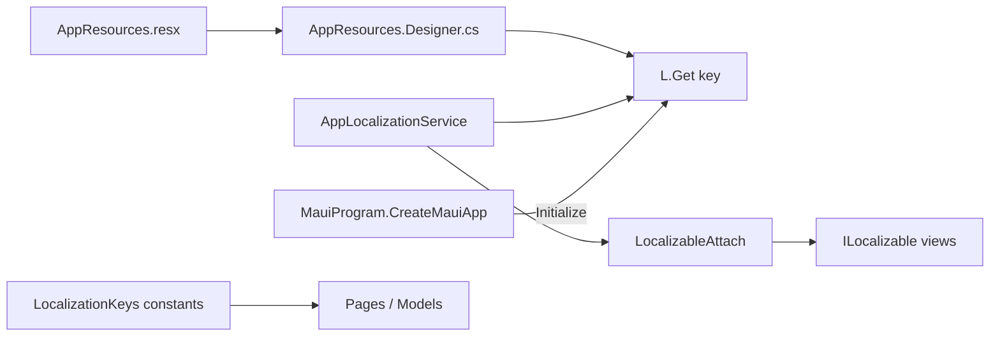

UI localization for the MAUI host: **RESX** strings (`Resources/Strings/AppResources`), runtime culture via **`AppLocalizationService`**, and static access through **`L`**.

## Flow

## Components

| Topic | Page |
| --- | --- |
| Static string accessor | [L](L/) |
| View refresh contract | [ILocalizable](ILocalizable/) |
| Loaded/unloaded wiring | [LocalizableAttach](LocalizableAttach/) |
| Compile-time key names | [LocalizationKeys](LocalizationKeys/) |
| RESX source | [Resources/Strings](../Resources/Strings/) |

## Usage in code

- Prefer **`L.Get(LocalizationKeys.Some_Key)`** or **`L.Get(key, args)`** in C# and bindings that call into code-behind.
- Views that build dynamic UI implement **`ILocalizable`** and call **`LocalizableAttach.Hook`** so text refreshes when the user changes language in settings.

Module-facing locale payloads are built separately (`ModuleLocalePayloadBuilder` — see Services when documented).
