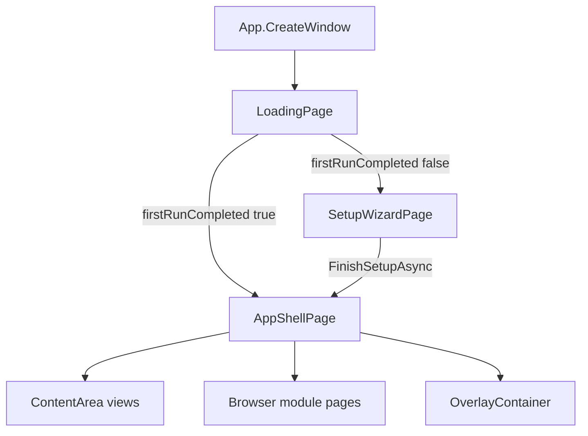

MAUI UI for the ASLM host (`ASLM/Pages/`). Types are **`ContentPage`** (full window) or **`ContentView`** (hosted in [AppShellPage](AppShellPage/)). Registered as **transient** in [MauiProgram](../MauiProgram/) except startup pages resolved explicitly from `IServiceProvider`.

---

## Navigation flow



---

## File map

| Source | Doc page |
| --- | --- |
| `LoadingPage.xaml(.cs)` | [LoadingPage](LoadingPage/) |
| `SetupWizardPage.xaml(.cs)` | [SetupWizardPage](SetupWizardPage/) |
| `AppShellPage.xaml(.cs)` | [AppShellPage](AppShellPage/) |
| `HomeView.xaml(.cs)` | [HomeView](HomeView/) |
| `ConsolesView.xaml(.cs)` | [ConsolesView](ConsolesView/) |
| `ModulesView.xaml(.cs)` | [ModulesView](ModulesView/) (+ `ModuleViewModel`) |
| `AslmApiView.xaml(.cs)` | [AslmApiView](AslmApiView/) |
| `SettingsView.xaml(.cs)` | [SettingsView](SettingsView/) |
| `NotificationsView.xaml(.cs)` | [NotificationsView](NotificationsView/) |
| `DownloadsView.xaml(.cs)` | [DownloadsView](DownloadsView/) |
| `ModuleUpdateView.xaml(.cs)` | [ModuleUpdateView](ModuleUpdateView/) |
| `ThemeColorPickerView.xaml(.cs)` | [ThemeColorPickerView](ThemeColorPickerView/) |

---

## Pages (`ContentPage`)

| Page | Role | Doc |
| --- | --- | --- |
| `LoadingPage` | One-shot startup + service init | [LoadingPage](LoadingPage/) |
| `SetupWizardPage` | First-run wizard + install | [SetupWizardPage](SetupWizardPage/) |
| `AppShellPage` | Shell, sidebar, WebView, toasts | [AppShellPage](AppShellPage/) |

---

## Shell content views

| View | Sidebar nav | Hosted in |
| --- | --- | --- |
| [HomeView](HomeView/) | Home | `ContentArea` |
| [ConsolesView](ConsolesView/) | Consoles (optional) | `ContentArea` |
| [ModulesView](ModulesView/) | Modules | `ContentArea` |
| [AslmApiView](AslmApiView/) | ASLM API (if server on) | `ContentArea` |
| Module `WebView` | Per-module button | `Browser` (`hasPage` modules) |

---

## Overlays (`AppShellPage.OverlayContainer`)

| View | Opened by | Doc |
| --- | --- | --- |
| [SettingsView](SettingsView/) | Settings button | Full settings dialog |
| [NotificationsView](NotificationsView/) | Notifications button | Anchored popover |
| [DownloadsView](DownloadsView/) | Download button | Catalog dialog |
| [ModuleUpdateView](ModuleUpdateView/) | Module card / toast | Per-module update |

---

## Shared patterns

### Localization

- Implement **`ILocalizable`** with **`ApplyLocalization()`**
- **`LocalizableAttach.Hook(element, AppLocalizationService, target)`** on `Loaded`/`Unloaded`
- Strings via **`L.Get(LocalizationKeys.*)`** ([Localization](../Localization/))

### Presenter pattern

| View | Presenter / VM (same `.cs` file) |
| --- | --- |
| `HomeView` | `HomeDashboardPresenter`, `HomeDashboardPageViewModel` |
| `ConsolesView` | `ConsolesPresenter`, `ConsolesPageViewModel` |

### Overlay close contract

```csharp
public event EventHandler? CloseRequested;
```

Shell sets `OverlayContainer.IsVisible = false` (and may clear `Content`).

### Theming

Controls use **`DynamicResource`** keys (`BackgroundPrimary`, `LabelPrimary`, `ActionBlue`, …) from [Resources](../Resources/Styles/). Sidebar/module icons may use **`PackagedIconTintCache`** + **`IconTintHelper`** ([AppShellPage](AppShellPage/)).

---

## Related docs

| Area | Link |
| --- | --- |
| Models / DTOs | [Models](../Models/) |
| Services (DI targets) | [Services](../Services/) |
| Host bootstrap | [MauiProgram](../MauiProgram/), [App](../App/) |
