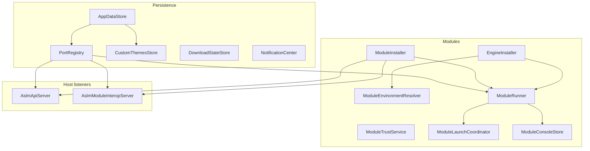

Singleton and static services registered in [MauiProgram](../MauiProgram/) (`builder.Services.AddSingleton<…>()`). They hold persistence, module/runtime orchestration, UI theming, notifications, downloads, and updates.

Pages are **transient**; services are **shared for the app lifetime**.

---

## Dependency graph (simplified)

---

## File map

| Source | Doc | Role |
| --- | --- | --- |
| `AppDataStore.cs` | [AppDataStore](AppDataStore/) | `ASLM_Data.json` |
| `SettingsService.cs` | [SettingsService](SettingsService/) | Settings page logic |
| `AppLocalizationService.cs` | [AppLocalizationService](AppLocalizationService/) | Culture + RESX |
| `PortRegistry.cs` | [PortRegistry](PortRegistry/) | `ASLM_Ports.json` |
| `NotificationCenter.cs` | [NotificationCenter](NotificationCenter/) | Toasts + persisted notifications |
| `OllamaSettingsStore.cs` | [OllamaSettingsStore](OllamaSettingsStore/) | Managed Ollama account |
| `CustomThemesStore.cs` | [CustomThemesStore](CustomThemesStore/) | Custom themes file |
| `ThemeService.cs` | [ThemeService](ThemeService/) | Apply palette to app resources |
| `ThemePaletteResolver.cs` | [ThemePaletteResolver](ThemePaletteResolver/) | Built-in + custom colors |
| `OsAppThemeReader.cs` | [OsAppThemeReader](OsAppThemeReader/) | Windows dark-mode registry |
| `ModuleThemePayloadBuilder.cs` | [ModuleThemePayloadBuilder](ModuleThemePayloadBuilder/) | Theme JSON for modules |
| `IconTintHelper.cs` | [IconTintHelper](IconTintHelper/) | Palette color lookup |
| `PackagedIconTintCache.cs` | [PackagedIconTintCache](PackagedIconTintCache/) | Tinted sidebar icons |
| `ProcessSnapshotReader.cs` | [ProcessSnapshotReader](ProcessSnapshotReader/) | OS process table cache |
| `ProcessTracker.cs` | [ProcessTracker](ProcessTracker/) | Windows job object |
| `DetachedProcessStarter.cs` | [DetachedProcessStarter](DetachedProcessStarter/) | Breakaway launcher start |
| `ModuleEnvironmentResolver.cs` | [ModuleEnvironmentResolver](ModuleEnvironmentResolver/) | Per-module venv |
| `ModuleTrustService.cs` | [ModuleTrustService](ModuleTrustService/) | Official / reviewed trust |
| `EngineInstaller.cs` | [EngineInstaller](EngineInstaller/) | Engine manifests |
| `ModuleInstaller.cs` | [ModuleInstaller](ModuleInstaller/) | Module manifests |
| `ModuleRunner.cs` | [ModuleRunner](ModuleRunner/) | Commands + processes |
| `ModuleStartThrottle.cs` | [ModuleStartThrottle](ModuleStartThrottle/) | Concurrent start limit |
| `ModuleLaunchCoordinator.cs` | [ModuleLaunchCoordinator](ModuleLaunchCoordinator/) | Card-equivalent launch |
| `ModuleConsoleStore.cs` | [ModuleConsoleStore](ModuleConsoleStore/) | Console sessions |
| `ConsoleOutputView.cs` | [ConsoleOutputView](ConsoleOutputView/) | MAUI console view |
| `ConsoleOutputViewHandler.cs` | [ConsoleOutputViewHandler](ConsoleOutputViewHandler/) | WinUI handler |
| `ModuleInteropHostState.cs` | [ModuleInteropHostState](ModuleInteropHostState/) | Interop URL snapshot |
| `ModuleLocalePayloadBuilder.cs` | [ModuleLocalePayloadBuilder](ModuleLocalePayloadBuilder/) | Locale JSON for modules |
| `AslmModuleInteropServer.cs` | [AslmModuleInteropServer](AslmModuleInteropServer/) | JSON HTTP interop |
| `AslmApiServer.cs` | [AslmApiServer](AslmApiServer/) | Reverse proxy mirror |
| `DownloadStateStore.cs` | [DownloadStateStore](DownloadStateStore/) | `ASLM_Downloads.json` |
| `DownloadCatalog.cs` | [DownloadCatalog](DownloadCatalog/) | Merged catalog UI model |
| `ModuleDownloadBridge.cs` | [ModuleDownloadBridge](ModuleDownloadBridge/) | Module bridge RPC |
| `DownloadInstaller.cs` | [DownloadInstaller](DownloadInstaller/) | Run install manifests |
| `DownloadTransferSpeedEstimator.cs` | [DownloadTransferSpeedEstimator](DownloadTransferSpeedEstimator/) | Speed labels |
| `GitHubUpdateClient.cs` | [GitHubUpdateClient](GitHubUpdateClient/) | GitHub API |
| `ReleaseTagOrdering.cs` | [ReleaseTagOrdering](ReleaseTagOrdering/) | Tag compare |
| `UpdateManager.cs` | [UpdateManager](UpdateManager/) | Update discovery/apply |
| `UpdateScheduler.cs` | [UpdateScheduler](UpdateScheduler/) | Background checks |
| `DockerService.cs` | [DockerService](DockerService/) | Docker CLI probe |

---

## By concern

### Startup ([LoadingPage](../Pages/LoadingPage/))

`AppDataStore.InitializeAsync` → trust, themes, notifications → `AslmApiServer` / `AslmModuleInteropServer` → `UpdateScheduler.Start` → `ThemeService.ApplyFromSettings`.

### Settings & personalization

[SettingsService](SettingsService/), [AppLocalizationService](AppLocalizationService/), [ThemeService](ThemeService/), [CustomThemesStore](CustomThemesStore/), [OllamaSettingsStore](OllamaSettingsStore/).

### Module runtime

[ModuleInstaller](ModuleInstaller/) → [ModuleRunner](ModuleRunner/) with [EngineInstaller](EngineInstaller/), [PortRegistry](PortRegistry/), [ModuleEnvironmentResolver](ModuleEnvironmentResolver/), [ProcessTracker](ProcessTracker/), [ModuleConsoleStore](ModuleConsoleStore/).

### Network surfaces

[AslmApiServer](AslmApiServer/) (optional mirror), [AslmModuleInteropServer](AslmModuleInteropServer/) (always on loopback).

### Downloads & updates

[DownloadCatalog](DownloadCatalog/) + [ModuleDownloadBridge](ModuleDownloadBridge/) + [DownloadInstaller](DownloadInstaller/); [UpdateManager](UpdateManager/) + [UpdateScheduler](UpdateScheduler/).

---

## Related docs

- [Pages](../Pages/) — UI consumers
- [Models](../Models/) — DTOs and config types
- [MauiProgram](../MauiProgram/) — DI registration
